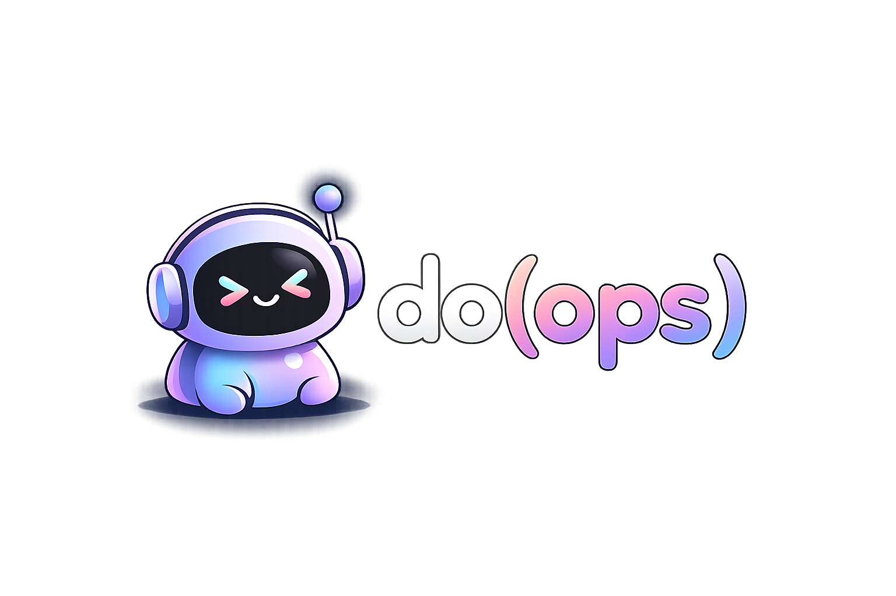

<a id="readme-top"></a>

<!-- PROJECT SHIELDS -->
<div align="center">

[![GitHub Release][release-shield]][release-url]
[![Go Version][go-shield]][go-url]
[![License][license-shield]][license-url]
[![Tests][tests-shield]][tests-url]
[![Security][security-shield]][security-url]

</div>

<!-- PROJECT LOGO -->
<div align="center">
  

  <h3>the do(ops) cli</h3>

  <p>A browsable catalog of automation scripts that operators can select, parameterize, and execute directly from the terminal.</p>

  <p>
    <a href="https://jacobhuemmer.github.io/dops-cli/">Documentation</a>
    &middot;
    <a href="https://github.com/jacobhuemmer/dops-cli/issues">Report Bug</a>
    &middot;
    <a href="https://github.com/jacobhuemmer/dops-cli/issues">Request Feature</a>
  </p>
</div>

<br />

<div align="center">
  
</div>

<br />

<!-- TABLE OF CONTENTS -->
<details>
  <summary>Table of Contents</summary>
  <ol>
    <li><a href="#about">About</a></li>
    <li><a href="#features">Features</a></li>
    <li><a href="#installation">Installation</a></li>
    <li><a href="#quick-start">Quick Start</a></li>
    <li><a href="#themes">Themes</a></li>
    <li><a href="#mcp-integration">MCP Integration</a></li>
    <li><a href="#keyboard-shortcuts">Keyboard Shortcuts</a></li>
    <li><a href="#shell-completion">Shell Completion</a></li>
    <li><a href="#development">Development</a></li>
    <li><a href="#getting-help">Getting Help</a></li>
    <li><a href="#license">License</a></li>
  </ol>
</details>


<!-- ABOUT -->
## About

dops is built for DevOps and platform engineering teams who need a consistent, safe way to run operational scripts. Instead of scattered shell scripts with tribal knowledge, dops organizes them into browsable catalogs with built-in parameter management, risk controls, and encrypted credential storage.

<p align="right">(<a href="#readme-top">back to top</a>)</p>


<!-- FEATURES -->
## Features

- **Interactive TUI** — sidebar catalog tree, metadata panel, live output pane, and wizard-driven parameter input
- **Catalog system** — organize runbooks locally or install shared catalogs from git repositories
- **Risk controls** — confirmation gates for high/critical risk runbooks, per-catalog risk policies
- **Encrypted vault** — saved parameters encrypted with [age](https://github.com/FiloSottile/age) (X25519 + ChaCha20-Poly1305)
- **Live execution** — real-time stdout/stderr streaming with scroll, search, and text selection
- **MCP server** — expose runbooks to AI agents via the [Model Context Protocol](https://modelcontextprotocol.io)
- **20 themes** — github, dracula, gruvbox, nord, synthwave, unicorn, and more
- **CLI mode** — run any runbook non-interactively with `dops run <id> --param key=value`

<p align="right">(<a href="#readme-top">back to top</a>)</p>


<!-- INSTALLATION -->
## Installation

### Homebrew (recommended)

```bash
brew tap jacobhuemmer/tap
brew install dops
```

### Go

```bash
go install github.com/jacobhuemmer/dops-cli@latest
```

### Docker (MCP server)

```bash
docker run -i -v ~/.dops:/data/dops ghcr.io/jacobhuemmer/dops-cli:latest
```

### From source

```bash
git clone https://github.com/jacobhuemmer/dops-cli.git
cd dops-cli
make build
./bin/dops
```

<p align="right">(<a href="#readme-top">back to top</a>)</p>


<!-- QUICK START -->
## Quick Start

**1. Initialize dops:**

```bash
dops init
```

This creates `~/.dops/` with a default config and a sample hello-world runbook.

**2. Launch the TUI:**

```bash
dops
```

**3. Navigate** with arrow keys, **run** with Enter, fill in parameters, and confirm.

**4. Install a shared catalog:**

```bash
dops catalog install https://github.com/your-org/runbooks.git
```

### Catalog structure

Catalogs are directories of runbooks. Each runbook is a folder with a `runbook.yaml` and a `script.sh`:

```
my-catalog/
├── check-health/
│   ├── runbook.yaml
│   └── script.sh
└── deploy-service/
    ├── runbook.yaml
    └── script.sh
```

### Runbook example

```yaml
name: check-health
version: 1.0.0
description: Runs health checks against a service endpoint
risk_level: medium
script: script.sh
parameters:
  - name: endpoint
    type: string
    required: true
    description: The endpoint to check
    scope: global
```

See the [runbook guide](https://jacobhuemmer.github.io/dops-cli/guides/runbooks) for the full YAML schema, parameter types, and shell scripting conventions.

<p align="right">(<a href="#readme-top">back to top</a>)</p>


<!-- THEMES -->
## Themes

dops ships with 20 built-in themes. Default: `github`.

```bash
dops config set theme=dracula
```

| | | | |
|---|---|---|---|
| `github` | `dracula` | `gruvbox` | `nord` |
| `monokai` | `synthwave` | `nightowl` | `one-dark` |
| `kanagawa` | `everforest` | `solarized` | `espresso` |
| `unicorn` | `ayu` | `zenburn` | `catppuccin-mocha` |
| `catppuccin-latte` | `rosepine-dawn` | `doop` | `tokyomidnight` |

Set `theme=rainbow` for a random theme on every launch.

Custom themes go in `~/.dops/themes/<name>.json`. See the [configuration reference](https://jacobhuemmer.github.io/dops-cli/reference/configuration) for the theme schema.

<p align="right">(<a href="#readme-top">back to top</a>)</p>


<!-- MCP INTEGRATION -->
## MCP Integration

dops exposes runbooks to AI agents via the [Model Context Protocol](https://modelcontextprotocol.io). Each runbook becomes an MCP tool with a JSON Schema.

### Claude Code

Add to `.claude/settings.json`:

```json
{
  "mcpServers": {
    "dops": {
      "command": "dops",
      "args": ["mcp", "serve"]
    }
  }
}
```

### Docker

```bash
# stdio transport
docker run -i -v ~/.dops:/data/dops ghcr.io/jacobhuemmer/dops-cli:latest

# HTTP transport
docker run -p 8080:8080 -v ~/.dops:/data/dops ghcr.io/jacobhuemmer/dops-cli:latest --transport http --port 8080
```

See the [MCP guide](https://jacobhuemmer.github.io/dops-cli/guides/mcp) for details on risk controls, resources, and streaming.

<p align="right">(<a href="#readme-top">back to top</a>)</p>


<!-- KEYBOARD SHORTCUTS -->
## Keyboard Shortcuts

| Key | Action |
|-----|--------|
| `↑↓` | Navigate / scroll |
| `Enter` | Run runbook |
| `←→` | Collapse/expand catalog |
| `/` | Search |
| `Tab` | Switch pane focus |
| `?` | Help overlay |
| `ctrl+x` | Stop execution |
| `ctrl+shift+p` | Command palette |
| `q` | Quit |

See the full [keyboard reference](https://jacobhuemmer.github.io/dops-cli/reference/keyboard-shortcuts) for output pane controls, search navigation, and wizard shortcuts.

<p align="right">(<a href="#readme-top">back to top</a>)</p>


<!-- SHELL COMPLETION -->
## Shell Completion

```bash
# Bash
dops completion bash > /etc/bash_completion.d/dops

# Zsh
dops completion zsh > "${fpath[1]}/_dops"

# Fish
dops completion fish > ~/.config/fish/completions/dops.fish

# PowerShell
dops completion powershell | Out-String | Invoke-Expression
```

<p align="right">(<a href="#readme-top">back to top</a>)</p>


<!-- DEVELOPMENT -->
## Development

```bash
make build       # Build binary
make test        # Run tests
make vet         # Go vet
make lint        # golangci-lint
make screenshots # Generate VHS screenshots
make docker      # Build Docker image
make ci          # Run CI checks (vet + test + build)
```

<p align="right">(<a href="#readme-top">back to top</a>)</p>


<!-- GETTING HELP -->
## Getting Help

- [Documentation](https://jacobhuemmer.github.io/dops-cli/) — guides, reference, and configuration
- [GitHub Issues](https://github.com/jacobhuemmer/dops-cli/issues) — bug reports and feature requests
- [CLI Reference](https://jacobhuemmer.github.io/dops-cli/reference/cli) — all commands and flags

<p align="right">(<a href="#readme-top">back to top</a>)</p>


<!-- SUPPORT -->
## Support

If you find dops useful, consider [buying me a coffee](https://buymeacoffee.com/jacobhuemmer)!

<p align="center">
  <a href="https://buymeacoffee.com/jacobhuemmer">
    
  </a>
</p>


<!-- LICENSE -->
## License

Distributed under the MIT License. See `LICENSE` for more information.

<p align="right">(<a href="#readme-top">back to top</a>)</p>


<!-- MARKDOWN LINKS & IMAGES -->
[release-shield]: https://img.shields.io/github/v/release/jacobhuemmer/dops-cli?style=for-the-badge
[release-url]: https://github.com/jacobhuemmer/dops-cli/releases
[go-shield]: https://img.shields.io/github/go-mod/go-version/jacobhuemmer/dops-cli?style=for-the-badge
[go-url]: https://go.dev/
[license-shield]: https://img.shields.io/github/license/jacobhuemmer/dops-cli?style=for-the-badge
[license-url]: https://github.com/jacobhuemmer/dops-cli/blob/main/LICENSE
[tests-shield]: https://img.shields.io/github/actions/workflow/status/jacobhuemmer/dops-cli/test.yml?style=for-the-badge&label=tests
[tests-url]: https://github.com/jacobhuemmer/dops-cli/actions/workflows/test.yml
[security-shield]: https://img.shields.io/github/actions/workflow/status/jacobhuemmer/dops-cli/security.yml?style=for-the-badge&label=security
[security-url]: https://github.com/jacobhuemmer/dops-cli/actions/workflows/security.yml
